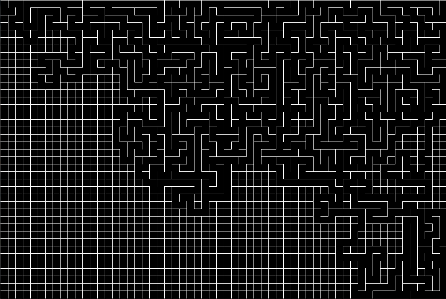
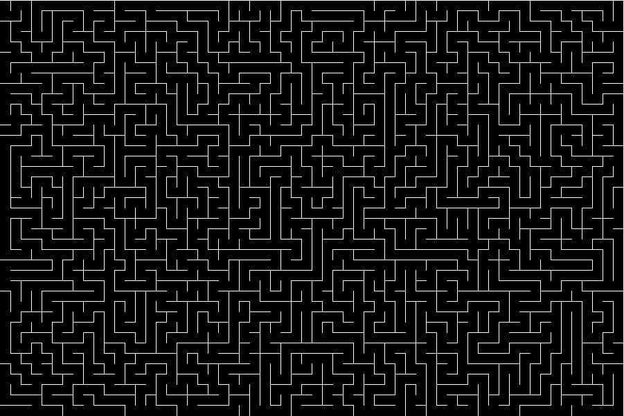
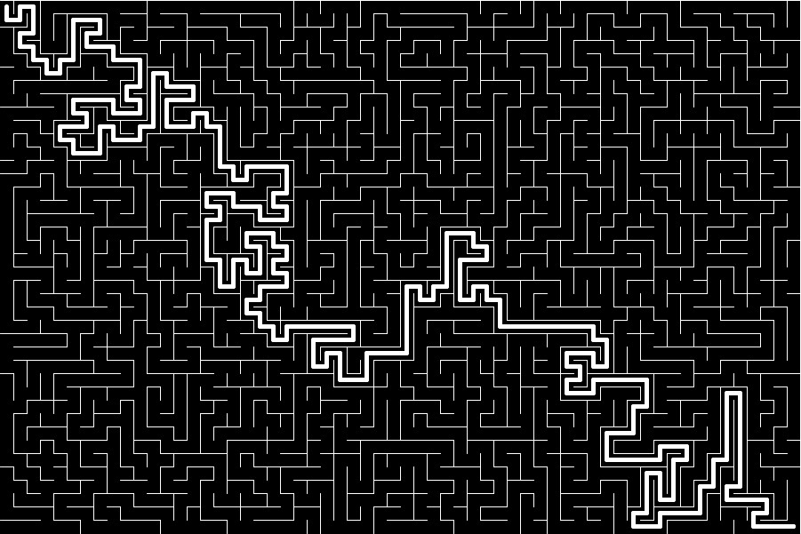

# Maze-pathfinder

Program napisany w Javie w środowisku graficznym Processing.  
Aby go skompilować wymagane jest środowisko.  
  
Program działa w dwóch fazach.  
Najpierw generuje labirynt,  
a następnie rozwiązuje go metodą wyszukiwania A*.  
  
Poradniki którymi sie inspirowałem (by Daniel Shiffman)
Generator labiryntu (1'część z 4):  
https://youtu.be/HyK_Q5rrcr4  
Algorytm A*:  
https://youtu.be/aKYlikFAV4k
  
Program zawiera parę rozwiązań mocno przyspieszających jego działanie.  
  
Program składa się z kodu głównago (BigBotBattle) i klasy (Spot)  
  
Program podczas genereownia:  
  
Wygenerowany labirynt:  
  
Znaleziona ścieżka:  

